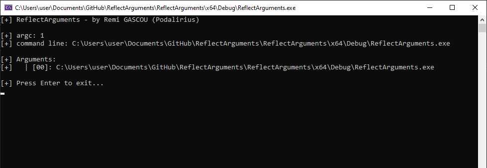

  A simple C++ Windows program to dump the raw arguments given in the command line.
   
  
  
  
   

## Features

 - [x] Outputs the raw command-line arguments passed to the program.

## Demonstration

Below is an example of the program in action:

## Contributing

Pull requests are welcome. Feel free to open an issue if you want to add other features.
